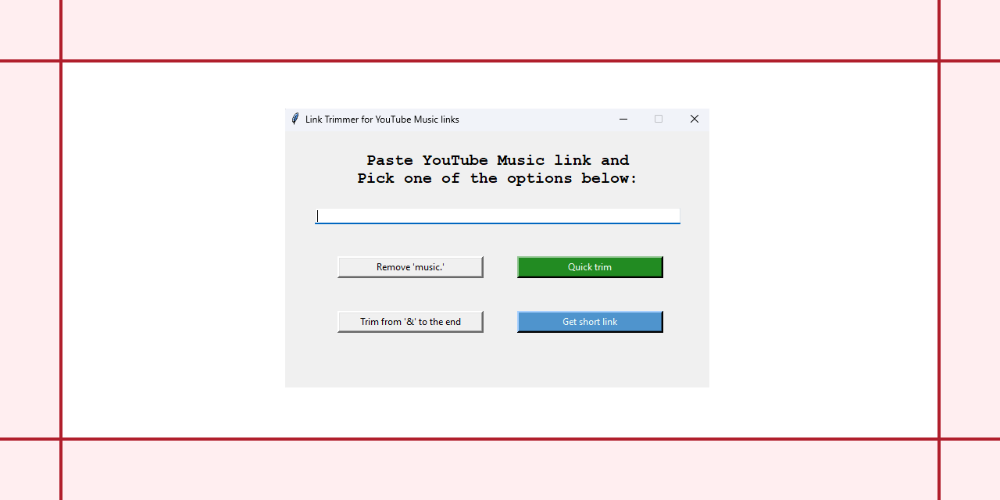

# 🎵 Link Trimmer for YouTube Music

A simple desktop app built with Python and Tkinter that trims and shortens YouTube Music links.  
It helps you remove unnecessary parts (like `music.` or parameters after `&`) and get a short, shareable Bitly link — automatically copied to your clipboard!

---

## ✨ Features

- ✅ Remove `music.` from URLs
- ✅ Trim everything after the first `&`
- ✅ Quick trim (both of the above)
- ✅ Shorten links with Bitly
- ✅ Copy results to clipboard on every action
- ✅ Lightweight and fast desktop tool

---

## 📸 Screenshot



---

## 🛠️ Installation

1. **Clone the repo:**

```bash
git clone https://github.com/your-username/link-trimmer.git
cd link-trimmer
```

2. **Install dependencies:**

```bash
pip install -r requirements.txt
```

3. **Create a .env file:**
```ini
BITLY_API=your_real_bitly_api_key_here
```

4. **Run the app:**

```bash
python main.py
```

## 🖥️ Build Executable (Optional)
```bash
pip install pyinstaller
pyinstaller --onefile --noconsole main.py
```

## 📄 Example Input/Output
Original YouTube Music link:
```arduino
https://music.youtube.com/watch?v=zqOWV_pq9Zs&feature=share
```

Trimmed link:
```arduino
https://music.youtube.com/watch?v=zqOWV_pq9Zs
```

Shortened link:
```arduino
https://bitly.link/zqOWV_pq9Zs
```
📋 Automatically copied to clipboard!


## 📤 License
MIT License

## 🙋‍♂️ Author
Created by chebishev

<a href="https://www.flaticon.com/free-icons/trim" title="trim icons">Trim icons created by Christ Design - Flaticon</a>