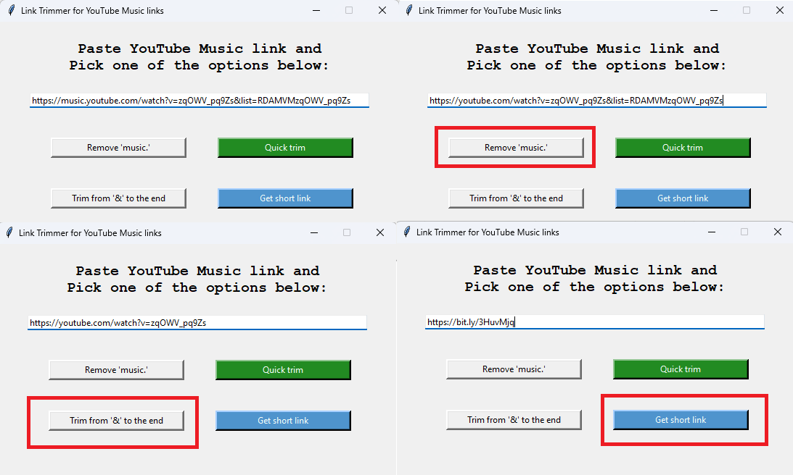

# linkTrimmer
Trims the unnecessary information from YouTube links

Intitially it was designed to trim "YouTube Music" links by removing "music." and all after the "&" sign (inclusive)

Now we have 4 buttons that can do the following thins:
- Remove "music." from the link
- Remove the ampersand symbol and anything after it (until the very end of the link)
- Quick (auto) Trim - Doing the operations above with one click
- Short url button associated with bit.ly. Needs API KEY, which I can't provide

The last 3 buttons can work with normal YouTube links if there is "&" or there is need for link to be shorten
Enjoy!

